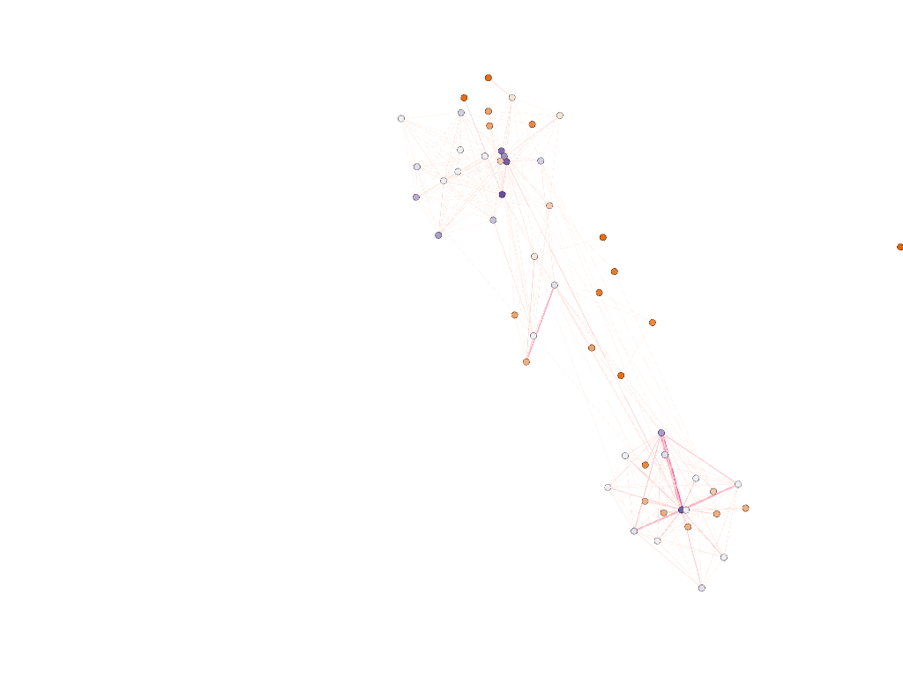
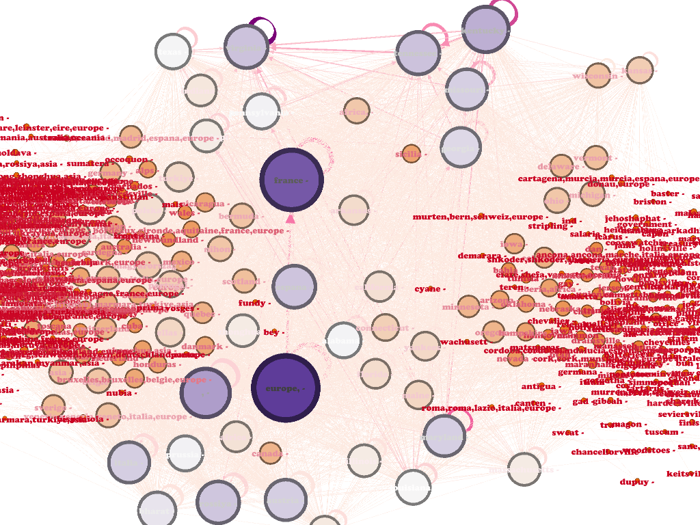

---
layout: post
title: Social Network Analysis Part (2)
image: /img/lukas_voit/Profil_Voit.JPG
---

I had to rely on another code of erica and used her adopted fixings. Also than added my own line to reduce the number of produced data, because my computer couldn´t
handle it. The code i used was:

```Python
import re, os

source = ".//Input_up_1300"
target = ".//Result_Toponyms"

#create a list and a dictionary to save the extracted information to
edgesDic = {} # dictionary for edges
edgesList = [] # list for names

def updateDic(dic, key): # updating dictionary, we got this piece of code
    if key in dic:
        dic[key] += 1
    else:
        dic[key] = 1
    
def taggedNames(unitText): # define function to collect tagged names in edgesList
    toponymsInUnit = [] #create list for names in unit
    for toponyms in re.findall(r'<placeName([^<]+)', unitText, flags=0):
            if 'tgn,':
                    match = re.search(r'reg="([\w,]+)"', toponyms)
                    if match:
                        toponym = match.group(1) #filter names
                        toponym = toponym.lower()
                        toponymsInUnit.append(toponym)
    return toponymsInUnit

import itertools # creating edges from a list, we got that code from our teacher as well
def edges(edgesList, edgesDic):
    edges = list(itertools.combinations(edgesList, 2))
    for e in edges:
        key = "\t".join(sorted(list(e))) # A > B (sorted alphabetically, to avoid cases of B > A)
        updateDic(edgesDic, key)
        

lof = os.listdir(source)
lof.sort()

for file in lof:
    with open(source + "/" + file, "r", encoding="utf8") as f1:
        text = f1.read()
            
        split = re.split('<div3', text) # split the text into units
        for unit in split[1:]:
            unit = "<div3" + unit # restore the integrity of units      
            # print(unit) #testing
            
            namesList = taggedNames(unit) # set value       
            edges(namesList, edgesDic) #create edges from nameslist


with open(target+"/"+"result_only_articles.tsv", "w", encoding="utf8") as resultFile:
    resultFile.write("source\ttarget\tweight\n")
    for edge in edgesDic: # separate key, value with tabs
        entry = edge+"\t"+str(edgesDic[edge])+"\n"
        resultFile.write(entry)


```

In a next step i tried to use the given match skript for the US.file, but had the problem that i couldn´t run it as my memory wasn´t sufficent.
This seems to be a problem of my Python32 Version as my computer can oly use 4 GB at a time, so i tried to reduce the number of articles. 
Later i will also install a python64 Version, maybe this will solve the problem.
I adopted this line to reduce the number of data.
```Python
unittype = re.findall(r'<div3 type="article"[^<]+>', unitText, flags=0)#only added when article
                if unittype:
```                

Used skript:

```Python
def loadGeoData(geosource): 
	dic = {} #create empty dictionary to save extracted information to
	lof = os.listdir(geosource)
	data = ""
	for file in lof:
		with open(".//US//geodata//" + file, "r", encoding="utf8") as f1: 
			data = data + f1.read() #reads file after file

	data = data.split("\n")
		
	for d in data:
		d1 = d.split("\t") # splits the line at each tab
		if len(d1) == 19: # all entries in the US.tsv-file have 19 columns - so this can be seen as a security measure
			val = "\t".join([[d1]+", "+d1[10], d1[4], d1[5]]) #appends geonameID, countrycode, latitude, and longitude in this order
			test = d1[1].lower() # sets geonameID lowercase

			if test in dic: #if the placename is mentioned in the dictionary, the extracted information from the geodatafile will be appended to that entry.
				dic[test].append(val)
			else:
				dic[test] = [val]
	return(dic)

#geoDataFile = "./US/US.tsv" --> using the US.tsv-file as a whole caused my computer to crash, so I had to split the file
geosource = ".//US//geodata" #set variable for geodata
geoData = loadGeoData(geosource) # executes function defined above


def processResults(file): 
	with open(file, "r", encoding="utf8") as f1: #opens designated file in utf8-encoding
		data = f1.read().split("\n") # splits the data at the end of every line
		data = data.lower() # data that's read from the file is set to lowercase

		newData = [] #empty list

		noResults = "\t".join(["NA", "NA", "NA"]) # variable for the case that there's no match

		for d in data:
			d1 = d.split("\t") #splits line by each tab
			if "," in d[1]: 
				test = d1[1].split(",")[0] #security measure, splits data if there's a comma, like "Richmond, VA", so only the first part of the regularized toponym is used (i.e. "Richmond"
			else:
				test = d1[1]

			if test in geoData: #condition: if there's a match
				for i in geoData[test]: #for item in geoData
					newData.append(d+"\t"+i) # appends matches to the empty list
			else:
				newData.append(d+"\t" + noResults)
				with open(target + "/" + "matchedResults.tsv", "w", encoding="utf8") as f9:
					f9.write("\n".join(newData))

processResults("res//freqList.tsv") # executes function defined above, defining where the results are saved

```

I still got this error message:


Problem is that the US-file is to big for my computer to handle it now.

So i just used the first script on just one dispatch file to lower the result.
I wanted to collect the data with qgis, but had the problem that i used the wrong latitude and longitude format for gephi as it has to be degrees.
Thats why i couldn´t use gephis geo layout algorithm. I will try it again, but right now just have this ungeoreferenced network with view points and this if the placedata from the hole dispatch.

Only Articles:


Complete places dispatch:


#Update (20.08.2018):

I at least got the right format for my coordinates in my analyzed last issue from my dispatch. So i could georeference the locations and can give a small peek how it could work with a bigger data sample, but i still couldn´t fix my memory issue. 


I also tried to combine the Geo_layout-Plugin with the Map-of-Countries-Plug-in. This Plug-In can add a map to the the Gephi working backround.
Normaly those two should match and as a result my edges should be correctly georeferenced on the map, but as can be seen here i still have some work to do.

